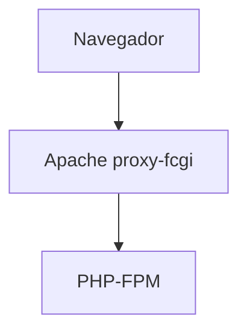
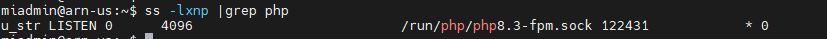
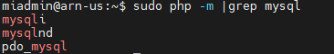

## 1. Entorno de Desarrollo

### 1.1 Ubuntu Server 24.04.3 LTS

Este documento es una guía detallada del proceso de instalación y configuración de un servidor de aplicaciones en Ubuntu Server utilizando Apache, con soporte PHP y MySQL

#### 1.1.1 **Configuración inicial**

##### Nombre  del equipo 

##### Configuración de red

> **Nombre de la máquina**: daw-used\
> **Memoria RAM**: 2G\
> **Particiones**: 150G(/) y resto (/var)\
> **Configuración de red interface**: xxxx \
> **Dirección IP** :xx.xx.xx.xx/22\
> **GW**: xx.xx.xx.xx/22\
> **DNS**: xx.xx.xx.xx

Editar el fichero de configuración del interface de red  **/etc/netplan**,

```bash
network:
  ethernets:
    enp0s3:
      addresses:
       - xx.xx.xx.xx/xx
      nameservers:
         addresses:
         - xx.xx.xx.xx
      routes:
          - to: default
             via: xx.xx.xx.xx
         search: [dominio]
  version: 2

````
Aplicar cambios de configuración
Comprobación y conectividad

##### Actualizar el sistema

```bash
sudo apt update
sudo apt upgrade
```

##### Configuración fecha y hora

[Establecer fecha, hora y zona horaria](https://somebooks.es/establecer-la-fecha-hora-y-zona-horaria-en-la-terminal-de-ubuntu-20-04-lts/ "Cambiar fecha y hora")

##### Cuentas administradoras

> - [X] root(inicio)
> - [ ] miadmin/paso
> - [ ] miadmin2/paso

##### Habilitar cortafuegos

como activar cortafuegos
#### Sistema de configuración regional
`locale` define como se muestran y se procesan los datos dependietnes del idioma y la región

En el fichero `/etc/default/locale` es el locale por defecto.
Para verificar:
```bash
locale
```
Se puede instalar un nuevo locale que no aparece en la lista, puedes generarlo::
```bash
sudo locale-gen es.MX.UTF-8
sudo locale-gen es_ES.UTF-8
sudo update-locale
```
Y para verificarlo
```bash
locale -a
```


- PHP puede heredar el locale del sistema Ubuntu
- Si usas php-intl, PHP tomará por defecto el definido en /etc/default/locale o en php.ini
- Tambien se puede definir en tus scripts con: 
 >setlocale(LC_ALL, 'es_MX.UTF-8'); <br>
Locale::setDefault('es_MX');


#### 1.1.2 Instalación del servidor web

##### Instalación

##### Verficación del servicio

##### Estructura de directorios y principales archivos

##### Activar .htaccess

https://apache2.com/2.2.2.en/howto/htaccess.html

##### Directivas

- DirectoryIndex
- Options Indexes
- ErrorLog
- CustomLog
- ErrorDocument
  

##### Virtual Hosts

##### Permisos y usuarios

##### Comandos 

#### 1.1.3 Servidor de PHP con PHP-FPM

FPM (FastCGI Process Manager) es un servidor de aplicaciones PHP que se encarga de interpretar código PHP.

 https://www.php.net/manual/es/install.fpm.php
 
###### Instalación
----


```bash
sudo apt install php8.3-fpm php8.3
```

###### Ficheros de configuración de PHP para php-fpm:
---


* **/etc/php/8.3/fpm/conf.d**: Módulos instalados en esta configuración de php (enlaces simbólicos a /etc/php/8.3/mods-available)
*  **/etc/php/8.3/fpm/php-fpm.conf** : Configuración general de php-fpm
*  **/etc/php/8.3/fpm/php.ini** : Configuración de php para este escenario
*  **/etc/php/8.3/fpm/pool.d** : Directorio con distintos pool de configuración. Cada aplicación puede tener una configuración distinta (procesos distintos) de php-fpm.
  
Por defecto tenemos un pool cuya configuración la encontramos en **/etc/php/8.3/fpm/pool.d/ www.conf**, en este fichero podemos configurar parámetros, los más importantes son:

* `[www]`: -es el nombre del pool, si tenemos varios, cada uno tiene que tener un nombre.
* `user` y `group` : Usuario y grupo con el que va a ejecutar los procesos
* `listen` Se indica el socket unix o el socket TCP donde se van a escuchar los procesos:
  * Por defecto, escucha por un socket unix: `listen=/run/php/php8.3-fpm.sock`
  * Si queremos que escuche por TCP: `listen=127.0.0.1:9000`
* Directivas de procesamiento, gestión de procesos:
  * `pm` Por defecto es igual a dynamic (el número de procesos se crean y se destruyen de forma dinámica). Otros valores: static o ondemand.
  * Otras directivas: `pm.max_children` (número máxio de procesos hijo que pueden ser creados al mismo tiempo para manejar solicitudes), `pm.start_servers` (cuantos procesos PHP-FPM se lanzararón al inicio de forma automática),`pm.min_spare_servers`( número mínimo de procesos del servidor inactivos para manejar nuevas solicitudes),...
  * `pm.status_path=/status` No es necesario, vamos a activar la URL de status para comprobar el estado del proceso.

Reiniciar el servicio:
```bash
sudo systemctl restart php8.3-fpm
```

###### Configuración de Apache2 con PHP-FPM
---

Apache2 va a funcionar como proxy inverso(reverse proxy) para las peticiones de los recursos php. Cuando solicitamos un fichero php, apache2 le pasará la petición a php-fpm para que interprete el php y luego devuelva la respuesta al servidor web.



```bash
sudo a2enmod proxy_fcgi setenvif
```

###### Activarlo para cada virtualhost
---

Un **socket** es un "canal de comunicación* entre dos procesos, en nuestro caso es entre el programa Apache con PHP-FPM.

**MÉTODO 1**

Se pueden usar dos tipos de SOCKET:

1. Si `php-fpm` está escuchando en un **SOCKET TCP**
 ---

Usa una dirección IP y un puerto para comunicarse, por lo tanto usa el protocolo TCP/IP (comunicación en red) y puede conectarse desde otra máquina si el puerto está abierto.
  
```bash
  ProxyPassMatch ^/(.*\.php)$ fcgi://127.0.0.1:9000/var/www/html/$1
```

- La directiva `ProxyPassMatch` indica a Apache que use un sistema proxy con una expresión regular para indicar qué peticiones redirigir.

- `^/(.*\.php)` Es la expresión regular que cpatura cualquier URL que termina en .php y el contenido del parentesis se guarda en $1. Por ejemplo: /index.php, /blog/post.php,etc
-  `fcgi://127.0.0.1:9000/var/www/html/$1` define el destino FastCGI donde enviará las peticiones:
-  `fcgi://` usa el protocolo FastCGI
-  `127.0.0.1:9000` dirección y puerto donde PHP-FPM está escuchando
-  `/var/www/html/$1` ruta real del archivo PHP en el servidor (Apache sustituye $1 por el nombre del archivo)

2. Si`php-fpm` está escuchando en un  **SOCKET UNIX (local)**
 ---
  
Existe un **archivo especial** en `/run/php/php8.3-fpm.sock`que actua como punto de comunicación dentro de la propia máquina en sistemas UNIX/Linux y no usa puertos ni direcciones IP.

```bash
  ProxyPassMatch ^/(.*\.php)$ unix:/run/php/php8.3-fpm.sock|fcgi://127.0.0.1/var/www/html
```

**MÉTODO 2**
Otra forma de hacerlo:

1. Si `php-fpm` está escuchando en un **socket TCP**
---

  La directiva `SetHandler` indica qué manejador debe usarse para procesar las solicitudes de ciertos archivos.
  En este caso los archivos PHP, los envía al proxy FastCGI
  
```bash
<FilesMatch "\.php$">
  	SetHandler "proxy:fcgi://127.0.0.1:9000"
  </FilesMatch>
```

2. Si `php-fpm` está escuchado en un **socket UNIX**
---

```bash
  <FilesMatch "\.php$">
 	  SetHandler "proxy:unix:/run/php/php8.2-fpm.sock|fcgi://127.0.0.1/"
  </FilesMatch>
```

###### Activarlo para todos los virtualhost
---

El fichero de configuración `php8.3-fpm`en el directorio `/etc/apache2/conf-available`, por defecto funciona cuando php-fpm está escuchando en un socket UNIX:

```bash
<FilesMatch ".+\.ph(?:ar|p|tml)$">
    SetHandler "proxy:unix:/run/php/php8.3-fpm.sock|fcgi://localhost"
</FilesMatch>
```

`<FilesMatch ".+\.ph(?:ar|p|tml)$"> ` Aplica esta configuración solo a archivos cuyo nombre coincida con esa expresión regular:

.+\.phar

.+\.php

.+\.phtml

Es decir: a cualquier archivo PHP o variantes (.phar, .php, .phtml).

`SetHandler "proxy:unix:/run/php/php8.3-fpm.sock|fcgi://localhost"`

Esta es la línea clave.

* `SetHandler`  define cómo Apache debe procesar esos archivos.

* `proxy` usa el módulo de Apache llamado mod_proxy.

* `unix:/run/php/php8.3-fpm.sock ` indica que la comunicación con PHP-FPM será a través de un socket UNIX local (no TCP).

* `|fcgi://localhost ` especifica el protocolo FastCGI, y que el destino lógico (nombre del backend) es “localhost”.
  
Por último activamos (o comprobar que esta activado):

```bash
sudo a2enconf php8.3-fpm
```

###### 1.1.4 Comprobación de funcionamiento PHP-FPM
---

PHP-FPM puede escuchar por socket UNIX o TCP/IP (host:puerto). Revisar cada "pool" en Ubuntu en `/etc/php/8.3/fpm/pool.d/www.conf`

```bash
grep '^listen' /etc/php/8.3/fpm/pool.d/*.conf
```

Dos posibles resultados:

```bash
listen = /run/php/php8.3-fpm.sock

```

Esta escuchando en socket UNIX

```bash
listen = 127.0.0.1:9000
```

Está escuchando por TCP/IP en la dirección local

Listar los procesos asociados a PHP-PFM
``` bash
   ss -xlnp |grep php
```



#### Configuración de PHP en entornos de desarrollo y de explotación
| General | Desarrollo | Producción |
| ---- | :----- | :---- |
| común | file-uploads = On <br> allow-url_fopen = On <br>memory_limit =  256M <br>upload_max_filesize = 100M <br>max_execution_time = 360 <br> date.timezone = Europe/Madrid  | file-uploads = On <br> allow-url_fopen = On <br>memory_limit =  256M <br>upload_max_filesize = 100M <br>max_execution_time = 360 <br> date.timezone = Europe/Madrid|
|Errores | display_errors  = On <br> error_reporting = E_ALL<br> display_startup_errors = On <br>|   display_errors  = Off <br>error_reporting = E_ALL & ~E_NOTICE <br>display_startup_errors = Off <br>log_errors = On

`file-uploads = On`

Esta directiva permite la subida de archivos a través de formularios en aplicaciones web. Cuando está activada, los archivos pueden ser enviados al servidor.

`allow_url_fopen = On`

Permite que funciones de PHP, como file_get_contents(), abran archivos a través de URLs, además de los archivos locales. Desactiva está opción para mejorar la seguridad, evitar la posibilidad de abrir recursos externos.

`memory_limit = 256M`

Establece la cantidad máxima de memoria que un script de PHP puede usar

`upload_max_filesize = 100M`

Define el tamaño máximo permitido para los archivos que se pueden subir al servidor. En este caso, se permite un tamaño de hasta 100 megabytes por archivo.

`max_execution_time = 360`

Especifica el tiempo máximo en segundos que un script de PHP puede ejecutarse. Aquí se permite un tiempo de 360 segundos (6 minutos).

`date.timezone = Europe/Madrid`

Establece la zona horaria para las funciones de fecha y hora en PHP. En este caso, se establece la zona horaria a Madrid, lo que asegura que las fechas y horas devueltas por el servidor sean correctas para esa región.

`display_errors = On`

Esta directiva activa la visualización de errores y advertencias de PHP directamente en la pantalla. Es útil durante el desarrollo y la depuración, ya que te permite ver inmediatamente qué errores están ocurriendo en el código. Sin embargo, en un entorno de producción, se recomienda desactivarla (Off) para evitar mostrar información sensible a los usuarios.

`error_reporting = E_ALL`

Reporta todos los errores, lo que ayuda a identificar problemas en el código.

`error_reporting = E_ALL & ~E_NOTICE`

Reporta errores críticos pero puede omitir avisos que no afectan la ejecución

`display_startup_errors = On`

Esta directiva permite que se muestren los errores que ocurren durante el inicio del script de PHP, antes de que se ejecute el código. Esto incluye errores en la carga de extensiones y configuraciones iniciales. Al igual que display_errors, es útil en entornos de desarrollo pero debe ser desactivada en producción para mantener la seguridad.

`log_errors = On`

Registra errores en un archivo, permitiendo a los administradores revisarlos sin exponer detalles a los usuarios.


#### 1.1.5 MariaDB
> **MariaDB** es un **sistema de gestión de bases de datos relacional (RDBMS)**, muy similar a MySQL, permitiendo almacenar, organizar y acceder a información mediante el **lenguaje SQL (Structured Query Language)**.
> Es una alternativa moderna y abierta a MySQL, muy usada en servidores web, aplicaciones empresariales y sistemas en la nube.
>

**Instalación de MariaDB**

En consola escribe el siguiente comando

```bash
sudo apt udpate
sudo apt install mariadb-server -y
```

**Fichero de configuración MariaDB**

En el directorio `/etc/mysql/mariadb.conf.d`se encuentrar los ficheros de configuración del servidor.
El archivo principal  de configuración `50-server.cnf` está definido el puerto , buscando la línea `port=3306`.

**Configurar Acceso Remoto**

Esto permitirá conectarse a la base de datos MariaDB desde otros equipos. Para habilitar el acceso remoto al servidor mariadb desde otros equipos, debes modificar el fichero de configuración.

```bash
sudo nano /etc/mysql/mariadb.conf.d/50-server.cnf
```

Localiza la línea `bind-address = 127.0.0.1` y cámbiala a :

```bash
bind-address = 0.0.0.0
```
Este cambio permite a mariadb acepte conexiones desde cualquier IP
Reinicia el servidor MariaDB:

```bash
sudo systemctl restart mariadb
```

**Comandos útiles del servicio**

| **Acción**                         | **Comando**                      | **Descripción**                                              |
| ---------------------------------- | -------------------------------- | ------------------------------------------------------------ |
| **Iniciar el servicio**            | `sudo systemctl start mariadb`   | Inicia el servidor MariaDB.                                  |
| **Detener el servicio**            | `sudo systemctl stop mariadb`    | Detiene el servidor MariaDB.                                 |
| **Reiniciar el servicio**          | `sudo systemctl restart mariadb` | Reinicia el servidor.                                        |
| **Ver estado del servicio**        | `sudo systemctl status mariadb`  | Muestra si el servidor está activo o inactivo.               |
| **Habilitar inicio automático**    | `sudo systemctl enable mariadb`  | Configura el servicio para iniciarse al arrancar el sistema. |
| **Deshabilitar inicio automático** | `sudo systemctl disable mariadb` | Evita que el servicio se inicie automáticamente.             |
| **Ver versión instalada**          | `mariadb --version`              | Muestra la versión actual de MariaDB instalada.              |


**Comprobación del puerto usado por el servidor Mariadb** es tcp/3306 por defecto.

1. Usando comandos del sistema
   El comando `ss`en Linux es una herramienta moderna y rapida para visualizar estadísticas de sockets y conexiones de red.

```bash
sudo ss -punta |grep mariadb

tcp   LISTEN  0  80  127.0.0.1:3306   0.0.0.0:*   users:(("mariadbd",pid=1234,fd=10))

```

2. Ver con consola de MariaDB

Entrar al cliente:

```bash
sudo mariadb
```

Luego ejecuta:

```bash
SHOW VARIABLES LIKE 'port';
```

Nos muestra como resultado:

| Variable_name | Value |
| --------------- | ------ |
| port          | 3306  |


**Listar los procesos en ejecución en el sistema** relacionados con el servidor mariadb

```bash
sudo ps -aux |grep maria
```

**Creación de un usuario administrador que utilice autenticación con constraseña**

> En sistemas Ubuntu con MariaDB 10.3, el usuario root de MariaDB se autentica mediante el `unix_socket`complemento por defecto, en lugar de una contraseña. Esto ofrece mayor seguridad y usabilidad en muchos casos, pero también puede complicar las cosas cuando se necesitan permisos administrativos para un programa externo (p. ej., phpMyAdmin).
> 
> Dado que el servidor utiliza la cuenta `raíz` para tareas como la rotación de registros y el inicio y la detención del servidor, es recomendable no modificar los datos de autenticación de la cuenta raíz `/etc/mysql/debian.cnf` . Cambiar las credenciales en el archivo de configuración puede funcionar inicialmente, pero las actualizaciones de paquetes podrían sobrescribir esos cambios. En lugar de modificar la cuenta raíz , los responsables del paquete recomiendan crear una cuenta administrativa independiente para el acceso con contraseña.

Para ello, crearemos una nueva cuenta llamada `adminsql`con las mismas funciones que la cuenta raíz , pero configurada para la autenticación con contraseña. Abra el prompt de MariaDB desde su terminal:

```bash
sudo mariadb
```

Luego, cree un nuevo usuario con privilegios de root y acceso mediante contraseña.

```bash
CREATE USER 'adminsql'@'%' IDENTIFIED BY 'password'
GRANT ALL ON *.* TO 'adminsql'@'%' WITH GRANT OPTION;

# o bien,

GRANT ALL ON *.* TO 'adminsql'@'%' IDENTIFIED BY 'password' WITH GRANT OPTION;
```

Listar todos los suarios y desde qué host pueden conectarse

```bash
SELECT User, Host FROM mysql.user;
```

Cómo conectarse de forma remota con el nuevo usuario

```bash
mariadb -u adminsql -p -h your_server_ip 
```

** Asegurar el servidor MariaDB
Para ello ejecutamos un **script de seguridad** de tu servidor MariaDB configurando una contraseña root fuerte, eliminando usuarios anónimos y deshabilitar el inicio de sesión del root de forma remota, ...

```bash
sudo mysql_secure_installation
```

Sigue las indicaciones para establecer la contraseña de root, eliminar usuarios anónimos, deshabilitar el inicio de sesión remoto de root, eliminar bases de datos de prueba y recargar las tablas de privilegios.
 continuación realizará una serie de cuestiones:

* En el primer paso preguntará por la contraseña de `root` para MariaDB, pulsa la tecla `Enter` ya que no hay contraseña definida.
* La siguiente, preguntará si quieres asignar una contraseña para el usuario “root”. Es recomendable usar una contraseña.
* En el tercer paso preguntará si quieres eliminar `usuario anónimo`, aquí indica que `Sí` quieres borrar los datos.
* Después preguntará si quieres desactivar el acceso remoto del usuario “root”, aquí indica que `Sí` quieres desactivar acceso remoto para usuario por seguridad.
* De nuevo preguntará si quieres eliminar la base de datos `test`, aquí indica de nuevo que Sí quieres borrar las base de datos de prueba.
* Por último, preguntará si quieres recargar privilegios, aquí indica que `Sí`.
  
#### 1.1.6 Modulos PHP

a) **php8.3-mysql**

Este módulo `php8.3-mysql`es la extensión que permite a PHP conectarse y comunicarse con servidores de bases de datos MySQL o MariaDB.
Sin este módulo, PHP no puede ejecutar consultas SQL, ni leer, ni escribir datos en su base de datos.
Instalación del módulo php8.3-mysql y reiniciar el servicio php8.3-fpm

```bash
sudo apt install php8.3-mysql
sudo systemctl restart php-fpm
```

| Módulo | Propósito | Estado actual |
| --- | :---- | :----- |
| php-mysql | Módulo antiguo (mezclaba mysql y mysqli) | Obsoleto desde PHP/
| php-mysqli | Extensión mejorada orientada a MySQL/MariaDB | Activa y recomendada
| php-pdo-mysql | Permite conexión vía PDO(interfaz orientada a objetos y más segunra) | Activa y recomendada

Mostrar que extensión se han instalado

```bash
sudo php -m | grep mysql
```



b) **php8.3-intl**

Es una extensión de internacionalización básica en la biblioteca ICU(International Components for Unicode)
Permite que PHP muestre información adaptada a la región e idioma, sin que tengas que hacerlo manualmente.

**Funciones principales php-intl**

| Funcionalidad | Descripción | Ejemplo |
| ----- | ----- | ----- |
| Formateo de fechas y horas | Muestra las fechas según el idioma o país | 27 de octubre de 2025(es) / October 27,2025(en) |
| Formateo de número | Muestra separaciones decimales y miles según región | 1.220,66 (es_ES), 1,2220.66 (en_US)|
|monedas | Formatea precios automáticamente según el país | € 1.200,50 / $ 1,200,50|
| Traducción y comparación de cadenas | Ordena y compara texto con reglas locales | útil para ordenar palabras con acentos |
|Normalización Unicode | Asegura que caracteres acentuados o especiales se comparen correctamente | útil para búsquedas y validaciones |

c) Modulo XDebug
`Xdebug` es una extensión (módulo) de PHP diseñada para ayudar en la depuración (debugging) y profiling (análisis de rendimiento) del código PHP.
En otras palabras, es una herramienta que permite ver qué hace tu programa internamente mientras se ejecuta, paso a paso, y medir su rendimiento.
Funciones principales
Depurador paso a paso (debugging)

* Permite pausar la ejecución del script en cualquier punto breakpoint
* Puede inspeccionar variables, pilas de llamadas (call stack) y valores de expresiones
* Se puede usar junto al IDE (VSCode, Netbeans, PhpStorm,etc)
* Comunicación del IDE mediante el protocolo DBGp (puerto 9003)

En primer lugar asegurate de que no está instalado

```bash
sudo php -v | grep xdebug
```

Si no aparece, instalálo:

```bash
sudo apt install php8.3-xdebug
```

Luego edita el fichero de configuración:

```bash
sudo nano /etc/php/8.3/fpm/conf.d/20-xdebug.ini
```

Y añade

```bash

xdebug.mode=develop,debug
xdebug.start_with_request=yes
xdebug.client_host=127.0.0.1
xdebug.client_port=9003
xdebug.log=/tmp/xdebug.log
xdebug.log_level=7
xdebug.idekey="netbeans-xdebug"
xdebug.discover_client_host=1
```

Guarda y reinicia el servidor

```bash
sudo systemctl restart apache2
# o si usas php-fpm
sudo systemctl restart php8.3-fpm
```

Dar permisos para escribir los log

```bash
sudo touch /tmp/xdebug.log
sudo chmod 666 /tmp/xdebug.log
sudo chown root:root /tmp/xdebug.log
```


#### 1.1.7 Servidor web seguro (HTTPS)
#### 1.1.8 DNS

#### 1.1.9 SFTP
#### 1.1.10 Apache Tomcat
#### 1.1.11 LDAP

