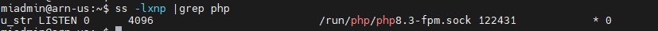

# CFGS Desarrollo de Aplicaciones Web

|  CFGS DESARROLLO  DE APLICACIONES WEB |
|:-----------:|
||
| DESPLIEGUE DE APLICACIONES WEB
| CYBERSEGURIDAD
| DAWES Tema 2. INSTALACIÓN, CONFIGURACIÓN Y DOCUMENTACIÓN DE ENTORNO DE DESARROLLO Y DEL ENTORNO DE EXPLOTACIÓN |


- [CFGS Desarrollo de Aplicaciones Web](#cfgs-desarrollo-de-aplicaciones-web)
  - [1. Entorno de Desarrollo](#1-entorno-de-desarrollo)
    - [1.1 Ubuntu Server 24.04.3 LTS](#11-ubuntu-server-24043-lts)
      - [1.1.1 **Configuración inicial**](#111-configuración-inicial)
        - [Nombre  del equipo](#nombre--del-equipo)
        - [Configuración de red](#configuración-de-red)
        - [Actualizar el sistema](#actualizar-el-sistema)
        - [Configuración fecha y hora](#configuración-fecha-y-hora)
        - [Cuentas administradoras](#cuentas-administradoras)
        - [Habilitar cortafuegos](#habilitar-cortafuegos)
      - [1.1.2 Instalación del servidor web](#112-instalación-del-servidor-web)
        - [Instalación](#instalación)
        - [Verficación del servicio](#verficación-del-servicio)
        - [Estructura de directorios y principales archivos](#estructura-de-directorios-y-principales-archivos)
        - [Activar .htaccess](#activar-htaccess)
        - [Directivas](#directivas)
        - [Virtual Hosts](#virtual-hosts)
        - [Permisos y usuarios](#permisos-y-usuarios)
        - [Comandos](#comandos)
      - [1.1.3 Servidor de PHP con PHP-FPM](#113-servidor-de-php-con-php-fpm)
          - [Instalación](#instalación-1)
          - [Ficheros de configuración de PHP para php-fpm:](#ficheros-de-configuración-de-php-para-php-fpm)
          - [Configuración de Apache2 con PHP-FPM](#configuración-de-apache2-con-php-fpm)
          - [Activarlo para cada virtualhost](#activarlo-para-cada-virtualhost)
          - [Activarlo para todos los virtualhost](#activarlo-para-todos-los-virtualhost)
          - [Comprobación de funcionamiento PHP-FPM](#comprobación-de-funcionamiento-php-fpm)
      - [1.1.4 MariaDB](#114-mariadb)
      - [1.1.5 XDebug](#115-xdebug)
      - [1.1.6 Servidor web seguro (HTTPS)](#116-servidor-web-seguro-https)
      - [1.1.7 DNS](#117-dns)
      - [1.1.8 SFTP](#118-sftp)
      - [1.1.9 Apache Tomcat](#119-apache-tomcat)
      - [1.1.10 LDAP](#1110-ldap)
    - [1.2 Windows 11](#12-windows-11)
      - [1.2.1 **Configuración inicial**](#121-configuración-inicial)
        - [**Nombre y configuración de red**](#nombre-y-configuración-de-red)
        - [**Cuentas administradoras**](#cuentas-administradoras-1)
      - [1.2.2 **Navegadores**](#122-navegadores)
      - [1.2.3 **FileZilla**](#123-filezilla)
      - [1.2.4 **Netbeans**](#124-netbeans)
      - [1.2.5 **Visual Studio Code**](#125-visual-studio-code)
  - [2. GitHub](#2-github)
  - [3.Entorno de Explotación](#3entorno-de-explotación)

## 1. Entorno de Desarrollo

### 1.1 Ubuntu Server 24.04.3 LTS

Este documento es una guía detallada del proceso de instalación y configuración de un servidor de aplicaciones en Ubuntu Server utilizando Apache, con soporte PHP y MySQL

#### 1.1.1 **Configuración inicial**

##### Nombre  del equipo 

##### Configuración de red

> **Nombre de la máquina**: daw-used\
> **Memoria RAM**: 2G\
> **Particiones**: 150G(/) y resto (/var)\
> **Configuración de red interface**: xxxx \
> **Dirección IP** :xx.xx.xx.xx/22\
> **GW**: xx.xx.xx.xx/22\
> **DNS**: xx.xx.xx.xx

Editar el fichero de configuración del interface de red  **/etc/netplan**,

```bash
network:
  ethernets:
    enp0s3:
      addresses:
       - xx.xx.xx.xx/xx
      nameservers:
         addresses:
         - xx.xx.xx.xx
      routes:
          - to: default
             via: xx.xx.xx.xx
         search: [dominio]
  version: 2

````
Aplicar cambios de configuración
Comprobación y conectividad

##### Actualizar el sistema

```bash
sudo apt update
sudo apt upgrade
```

##### Configuración fecha y hora

[Establecer fecha, hora y zona horaria](https://somebooks.es/establecer-la-fecha-hora-y-zona-horaria-en-la-terminal-de-ubuntu-20-04-lts/ "Cambiar fecha y hora")

##### Cuentas administradoras

> - [X] root(inicio)
> - [ ] miadmin/paso
> - [ ] miadmin2/paso

##### Habilitar cortafuegos

como activar cortafuegos

#### 1.1.2 Instalación del servidor web

##### Instalación

##### Verficación del servicio

##### Estructura de directorios y principales archivos

##### Activar .htaccess

https://apache2.com/2.2.2.en/howto/htaccess.html

##### Directivas

- DirectoryIndex
- Options Indexes
- ErrorLog
- CustomLog
  

##### Virtual Hosts

##### Permisos y usuarios

##### Comandos 

#### 1.1.3 Servidor de PHP con PHP-FPM

FPM (FastCGI Process Manager) es un servidor de aplicaciones PHP que se encarga de interpretar código PHP.

 https://www.php.net/manual/es/install.fpm.php
 
###### Instalación
----


```bash
sudo apt install php8.3-fpm php8.3
```

###### Ficheros de configuración de PHP para php-fpm:
---


* **/etc/php/8.3/fpm/conf.d**: Módulos instalados en esta configuración de php (enlaces simbólicos a /etc/php/8.3/mods-available)
*  **/etc/php/8.3/fpm/php-fpm.conf** : Configuración general de php-fpm
*  **/etc/php/8.3/fpm/php.ini** : Configuración de php para este escenario
*  **/etc/php/8.3/fpm/pool.d** : Directorio con distintos pool de configuración. Cada aplicación puede tener una configuración distinta (procesos distintos) de php-fpm.
  
Por defecto tenemos un pool cuya configuración la encontramos en **/etc/php/8.3/fpm/pool.d/ www.conf**, en este fichero podemos configurar parámetros, los más importantes son:

* `[www]`: -es el nombre del pool, si tenemos varios, cada uno tiene que tener un nombre.
* `user` y `group` : Usuario y grupo con el que va a ejecutar los procesos
* `listen` Se indica el socket unix o el socket TCP donde se van a escuchar los procesos:
  * Por defecto, escucha por un socket unix: `listen=/run/php/php8.3-fpm.sock`
  * Si queremos que escuche por TCP: `listen=127.0.0.1:9000`
* Directivas de procesamiento, gestión de procesos:
  * `pm` Por defecto es igual a dynamic (el número de procesos se crean y se destruyen de forma dinámica). Otros valores: static o ondemand.
  * Otras directivas: `pm.max_children` (número máxio de procesos hijo que pueden ser creados al mismo tiempo para manejar solicitudes), `pm.start_servers` (cuantos procesos PHP-FPM se lanzararón al inicio de forma automática),`pm.min_spare_servers`( número mínimo de procesos del servidor inactivos para manejar nuevas solicitudes),...
  * `pm.status_path=/status` No es necesario, vamos a activar la URL de status para comprobar el estado del proceso.

Reiniciar el servicio:
```bash
sudo systemctl restart php8.3-fpm
```

###### Configuración de Apache2 con PHP-FPM
---

Apache2 va a funcionar como proxy inverso(reverse proxy) para las peticiones de los recursos php. Cuando solicitamos un fichero php, apache2 le pasará la petición a php-fpm para que interprete el php y luego devuelva la respuesta al servidor web.


```bash
sudo a2enmod proxy_fcgi setenvif
```

###### Activarlo para cada virtualhost
---

Un **socket** es un "canal de comunicación* entre dos procesos, en nuestro caso es entre el programa Apache con PHP-FPM.

**MÉTODO 1**

Se pueden usar dos tipos de SOCKET:

1. Si `php-fpm` está escuchando en un **SOCKET TCP**
 ---

Usa una dirección IP y un puerto para comunicarse, por lo tanto usa el protocolo TCP/IP (comunicación en red) y puede conectarse desde otra máquina si el puerto está abierto.
  
```bash
  ProxyPassMatch ^/(.*\.php)$ fcgi://127.0.0.1:9000/var/www/html/$1
```

- La directiva `ProxyPassMatch` indica a Apache que use un sistema proxy con una expresión regular para indicar qué peticiones redirigir.

- `^/(.*\.php)` Es la expresión regular que cpatura cualquier URL que termina en .php y el contenido del parentesis se guarda en $1. Por ejemplo: /index.php, /blog/post.php,etc
-  `fcgi://127.0.0.1:9000/var/www/html/$1` define el destino FastCGI donde enviará las peticiones:
-  `fcgi://` usa el protocolo FastCGI
-  `127.0.0.1:9000` dirección y puerto donde PHP-FPM está escuchando
-  `/var/www/html/$1` ruta real del archivo PHP en el servidor (Apache sustituye $1 por el nombre del archivo)

2. Si`php-fpm` está escuchando en un  **SOCKET UNIX (local)**
 ---
  
Existe un **archivo especial** en `/run/php/php8.3-fpm.sock`que actua como punto de comunicación dentro de la propia máquina en sistemas UNIX/Linux y no usa puertos ni direcciones IP.

```bash
  ProxyPassMatch ^/(.*\.php)$ unix:/run/php/php8.3-fpm.sock|fcgi://127.0.0.1/var/www/html
```

**MÉTODO 2**
Otra forma de hacerlo:

1. Si `php-fpm` está escuchando en un **socket TCP**
---

  La directiva `SetHandler` indica qué manejador debe usarse para procesar las solicitudes de ciertos archivos.
  En este caso los archivos PHP, los envía al proxy FastCGI
  
```bash
<FilesMatch "\.php$">
  	SetHandler "proxy:fcgi://127.0.0.1:9000"
  </FilesMatch>
```

2. Si `php-fpm` está escuchado en un **socket UNIX**
---

```bash
  <FilesMatch "\.php$">
 	  SetHandler "proxy:unix:/run/php/php8.2-fpm.sock|fcgi://127.0.0.1/"
  </FilesMatch>
```

###### Activarlo para todos los virtualhost
---

El fichero de configuración `php8.3-fpm`en el directorio `/etc/apache2/conf-available`, por defecto funciona cuando php-fpm está escuchando en un socket UNIX:

```bash
<FilesMatch ".+\.ph(?:ar|p|tml)$">
    SetHandler "proxy:unix:/run/php/php8.3-fpm.sock|fcgi://localhost"
</FilesMatch>
```

`<FilesMatch ".+\.ph(?:ar|p|tml)$"> ` Aplica esta configuración solo a archivos cuyo nombre coincida con esa expresión regular:

.+\.phar

.+\.php

.+\.phtml

Es decir: a cualquier archivo PHP o variantes (.phar, .php, .phtml).

`SetHandler "proxy:unix:/run/php/php8.3-fpm.sock|fcgi://localhost"`

Esta es la línea clave.

* `SetHandler`  define cómo Apache debe procesar esos archivos.

* `proxy` usa el módulo de Apache llamado mod_proxy.

* `unix:/run/php/php8.3-fpm.sock ` indica que la comunicación con PHP-FPM será a través de un socket UNIX local (no TCP).

* `|fcgi://localhost ` especifica el protocolo FastCGI, y que el destino lógico (nombre del backend) es “localhost”.
  
Por último activamos (o comprobar que esta activado):

```bash
sudo a2enconf php8.3-fpm
```

###### Comprobación de funcionamiento PHP-FPM
---

PHP-FPM puede escuchar por socket UNIX o TCP/IP (host:puerto). Revisar cada "pool" en Ubuntu en `/etc/php/8.3/fpm/pool.d/www.conf`

```bash
grep '^listen' /etc/php/8.3/fpm/pool.d/*.conf
```

Dos posibles resultados:

```bash
listen = /run/php/php8.3-fpm.sock

```

Esta escuchando en socket UNIX

```bash
listen = 127.0.0.1:9000
```

Está escuchando por TCP/IP en la dirección local

Listar los procesos asociados a PHP-PFM
``` bash
   ss -xlnp |grep php
```



#### 1.1.4 MariaDB
> **MariaDB** es un **sistema de gestión de bases de datos relacional (RDBMS)**, muy similar a MySQL, permitiendo almacenar, organizar y acceder a información mediante el **lenguaje SQL (Structured Query Language)**.
> Es una alternativa moderna y abierta a MySQL, muy usada en servidores web, aplicaciones empresariales y sistemas en la nube.
>

**Instalación de MariaDB**

En consola escribe el siguiente comando

```bash
sudo apt udpate
sudo apt install mariadb-server -y
```

**Fichero de configuración MariaDB**

En el directorio `/etc/mysql/mariadb.conf.d`se encuentrar los ficheros de configuración del servidor.
El archivo principal  de configuración `50-server.cnf` está definido el puerto , buscando la línea `port=3306`.

**Comandos útiles del servicio**

| **Acción**                         | **Comando**                      | **Descripción**                                              |
| ---------------------------------- | -------------------------------- | ------------------------------------------------------------ |
| **Iniciar el servicio**            | `sudo systemctl start mariadb`   | Inicia el servidor MariaDB.                                  |
| **Detener el servicio**            | `sudo systemctl stop mariadb`    | Detiene el servidor MariaDB.                                 |
| **Reiniciar el servicio**          | `sudo systemctl restart mariadb` | Reinicia el servidor.                                        |
| **Ver estado del servicio**        | `sudo systemctl status mariadb`  | Muestra si el servidor está activo o inactivo.               |
| **Habilitar inicio automático**    | `sudo systemctl enable mariadb`  | Configura el servicio para iniciarse al arrancar el sistema. |
| **Deshabilitar inicio automático** | `sudo systemctl disable mariadb` | Evita que el servicio se inicie automáticamente.             |
| **Ver versión instalada**          | `mariadb --version`              | Muestra la versión actual de MariaDB instalada.              |


**Comprobación del puerto usado por el servidor Mariadb** es tcp/3306 por defecto.

1. Usando comandos del sistema

```bash
sudo ps -punta |grep mariadb

tcp   LISTEN  0  80  127.0.0.1:3306   0.0.0.0:*   users:(("mariadbd",pid=1234,fd=10))

```
2. Ver con consola de MariaDB

Entrar al cliente:
```bash
sudo mariadb
```
Luego ejecuta:
```bash
SHOW VARIABLES LIKE 'port';
```
Nos muestra como resultado:

| Variable_name | Value |
| --------------- | ------ |
| port          | 3306  |


**Listar los procesos en ejecución** relacionados con el servidor mariadb

```bash
sudo ps -aux |grep maria
```

**Creación de un usuario administrador que utilice autenticación con constraseña**

> En sistemas Ubuntu con MariaDB 10.3, el usuario root de MariaDB se autentica mediante el `unix_socket`complemento por defecto, en lugar de una contraseña. Esto ofrece mayor seguridad y usabilidad en muchos casos, pero también puede complicar las cosas cuando se necesitan permisos administrativos para un programa externo (p. ej., phpMyAdmin).
> 
> Dado que el servidor utiliza la cuenta `raíz` para tareas como la rotación de registros y el inicio y la detención del servidor, es recomendable no modificar los datos de autenticación de la cuenta raíz `/etc/mysql/debian.cnf` . Cambiar las credenciales en el archivo de configuración puede funcionar inicialmente, pero las actualizaciones de paquetes podrían sobrescribir esos cambios. En lugar de modificar la cuenta raíz , los responsables del paquete recomiendan crear una cuenta administrativa independiente para el acceso con contraseña.

Para ello, crearemos una nueva cuenta llamada `adminsql`con las mismas funciones que la cuenta raíz , pero configurada para la autenticación con contraseña. Abra el prompt de MariaDB desde su terminal:

```bash
sudo mariadb
```

Luego, cree un nuevo usuario con privilegios de root y acceso mediante contraseña.

```bash
GRANT ALL ON *.* TO 'adminsql'@'%' IDENTIFIED BY 'password' WITH GRANT OPTION;
```


#### 1.1.5 XDebug
`Xdebug` es una extensión (módulo) de PHP diseñada para ayudar en la depuración (debugging) y profiling (análisis de rendimiento) del código PHP.
En otras palabras, es una herramienta que permite ver qué hace tu programa internamente mientras se ejecuta, paso a paso, y medir su rendimiento.
Funciones principales
Depurador paso a paso (debugging)

* Permite pausar la ejecución del script en cualquier punto breakpoint
* Puede inspeccionar variables, pilas de llamadas (call stack) y valores de expresiones
* Se puede usar junto al IDE (VSCode, Netbeans, PhpStorm,etc)
* Comunicación del IDE mediante el protocolo DBGp (puerto 9003)

En primer lugar asegurate de que no está instalado

```bash
sudo php -v | grep xdebug
```

Si no aparece, instalálo:

```bash
sudo apt install php8.3-xdebug
```

Luego edita el fichero de configuración:

```bash
sudo nano /etc/php/8.3/fpm/conf.d/20-xdebug.ini
```

Y añade

```bash

xdebug.mode=develop,debug
xdebug.start_with_request=yes
xdebug.client_host=127.0.0.1
xdebug.client_port=9003
xdebug.log=/tmp/xdebug.log
xdebug.log_level=7
xdebug.idekey="netbeans-xdebug"
xdebug.discover_client_host=1
```

Guarda y reinicia el servidor

```bash
sudo systemctl restart apache2
# o si usas php-fpm
sudo systemctl restart php8.3-fpm
```

#### 1.1.6 Servidor web seguro (HTTPS)
#### 1.1.7 DNS


#### 1.1.8 SFTP
#### 1.1.9 Apache Tomcat
#### 1.1.10 LDAP

### 1.2 Windows 11
#### 1.2.1 **Configuración inicial**
##### **Nombre y configuración de red**
##### **Cuentas administradoras**
#### 1.2.2 **Navegadores**
#### 1.2.3 **FileZilla**
#### 1.2.4 **Netbeans**
#### 1.2.5 **Visual Studio Code**

## 2. GitHub
## 3.Entorno de Explotación

---

> **Nombre y Apellidos**  
> Curso: 2025/2026  
> 2º Curso CFGS Desarrollo de Aplicaciones Web  

